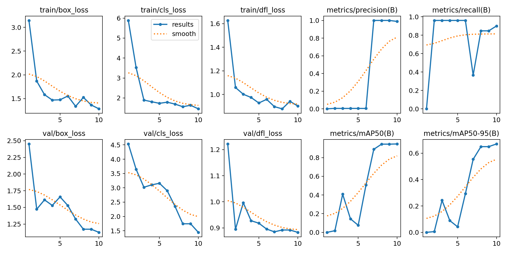
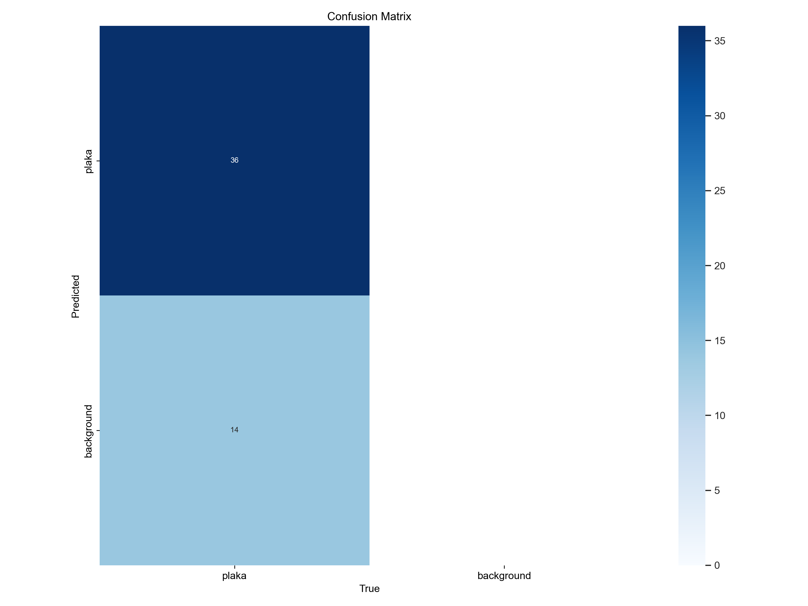
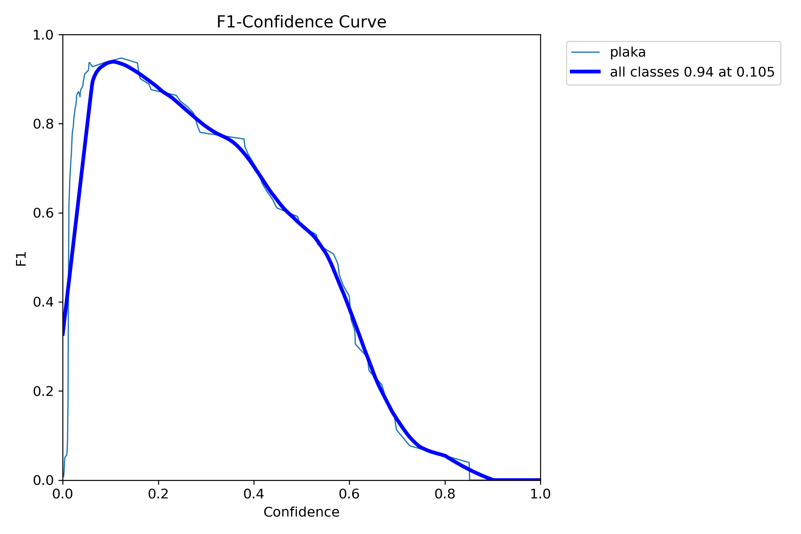
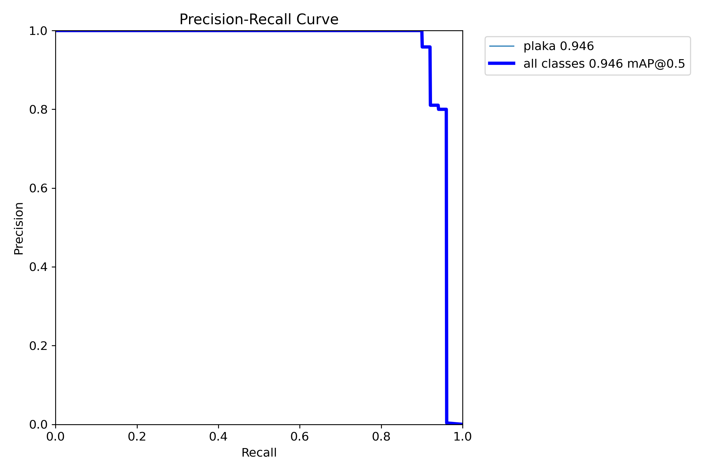

# 🚗 YOLOv8 ile Türk Plaka Tespit Sistemi

Bu proje, YOLOv8 derin öğrenme modeli kullanılarak Türk araç plakalarını tespit eden bir yapay zeka sistemi geliştirmektedir. Proje, YOLOv8'in nesne tespiti yeteneklerini kullanarak araç plakalarını yüksek doğrulukla ve gerçek zamanlı olarak tespit etmektedir.

## 🎯 Proje Hakkında

- **Model**: YOLOv8n (nano) - hafif ve hızlı çalışan bir nesne tespit modeli
- **Eğitim Metodu**: Transfer Learning (Aktarımlı Öğrenme)
- **Veri Seti**: Türk Plaka Veri Seti ([Kaggle Turkish License Plate Dataset](https://www.kaggle.com/datasets/smaildurcan/turkish-license-plate-dataset))
- **Eğitim Süresi**: 10 Epoch
- **Başarı Oranı**: mAP50: 0.946, mAP50-95: 0.67


## 📋 Özellikler

- ✅ Farklı açılardan plaka tespiti
- ✅ Farklı ışık koşullarında çalışabilme
- ✅ Gerçek zamanlı tespit yeteneği
- ✅ Yüksek doğruluk oranı
- ✅ Kolay kullanım arayüzü

## 📊 Eğitim Detayları

Proje, önceden eğitilmiş YOLOv8n modelini baz alarak, transfer learning yaklaşımıyla gerçekleştirilmiştir. Eğitim için Kaggle'da bulunan [Türk Plaka Veri Seti](https://www.kaggle.com/datasets/smaildurcan/turkish-license-plate-dataset) kullanılmıştır.

- **Kullanılan veri**: Toplam veri setinden 50 adet görüntü (tam veri seti 1500 görüntü içermektedir)
- **Eğitim Parametreleri**:
  - epochs: 10
  - img size: 320x320
  - batch size: 4
  - optimizer: AdamW
  - learning rate: 0.01 (otomatik ayarlanır)

### Eğitim Grafikleri

<p align="center">
  
</p>

<p align="center">
  
</p>

<p align="center">
   
  
</p>

## 🔍 Test Sonuçları

Model eğitimi sonucunda elde edilen metrikler (10. epoch):

```
Class     Images  Instances      Box(P          R      mAP50  mAP50-95)
all           50         50      0.989        0.9      0.946       0.67
```

Eğitimin son epoch verilerine göre (%94.6 mAP50 başarı oranı):

```
epoch,time,train/box_loss,train/cls_loss,train/dfl_loss,metrics/precision(B),metrics/recall(B),metrics/mAP50(B),metrics/mAP50-95(B)
10,229.505,1.28521,1.45631,0.90175,0.98891,0.9,0.94646,0.67031
```

## 🛠️ Kullanım

### Gereksinimler

```
ultralytics==8.3.132
torch>=2.0.0
opencv-python>=4.5.0
matplotlib>=3.3.0
```


### Plaka Tespiti İçin

```python
from ultralytics import YOLO
import cv2

# Eğitilmiş modeli yükle
model = YOLO("best.pt")

# Görüntü üzerinde tespit yap
results = model.predict("ornek_resim.jpg", save=True, conf=0.25)

# Sonuçları göster
for r in results:
    print(f"Toplam {len(r.boxes)} adet plaka tespit edildi.")
```

## 📚 Kaynaklar

- [YOLOv8 Resmi Dokümantasyon](https://docs.ultralytics.com/)
- [Türk Plaka Veri Seti](https://www.kaggle.com/datasets/smaildurcan/turkish-license-plate-dataset)


## 📜 Lisans

Bu proje [Apache 2.0](LICENSE) lisansı altında lisanslanmıştır. 
